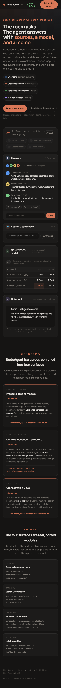

<div align="center">

# NodeAgent

### The room asks. The agent answers — with sources, a model, and a memo.

**A cross-collaborative agent that gathers live context from a shared room, finds the right
document for the right answer, updates the model as a versioned delta, and writes it into a
notebook — as one loop.**

`live chat + context` · `grounded search & synthesis` · `versioned spreadsheet` · `TipTap notebook`

[Quickstart](#quickstart) · [The four surfaces](#the-four-surfaces) · [Why this shape](#why-this-shape-a-career-compiled) · [Architecture](docs/ARCHITECTURE.md) · [Demo script](docs/DEMO_SCRIPT.md)

</div>

---

NodeAgent is the distilled, portfolio-grade core of [NodeBench AI](#provenance) — the four
capabilities I kept reaching for, rebuilt as clean, tested, dependency-light TypeScript and
wired into a single agent loop. It runs as a **self-contained prototype with no keys at all**
(deterministic demo data) and ships the **Convex schema + modules** that back the live,
multiplayer version.

> **One loop, four surfaces.** A teammate asks a question in a live room → the agent gathers
> the relevant context → searches and synthesizes a *grounded, cited* answer → corrects the
> model and bumps its version → writes the memo. Every step is bounded, every failure is
> surfaced, and the whole thing is honest about what it doesn't know.

<div align="center">


<sub>The agent loop, run: room context gathered, search ranks 4 sources and highlights the winner,
the model bumps to v4 with a delta log, the notebook holds the grounded claim. <br/>
<b>No account, no keys</b> — press <kbd>R</kbd> or click <b>Run the agent</b>.</sub>

</div>

## Quickstart

Three ways to see it, fastest first:

```bash
# 1. Instant — zero install, zero build. Runs the real loop's math and prints the result.
node demo/runNodeAgentDemo.mjs

# 2. The browser prototype (the centerpiece). Self-contained, responsive, no keys.
npm install
npm run proto          # opens /nodeagent-v1.html — then click "Run the agent"

# 3. The React app + the real modules' CLI demo
npm run dev            # the React surface (src/app + NodeAgentDemoApp)
npm run demo           # the loop over the canonical scenario, via tsx
```

Verify it for yourself:

```bash
npm run typecheck      # tsc --noEmit, clean
npm run test           # 31 scenario-based tests across the 4 modules + the loop
npm run build          # vite build, clean
```

To light up the **live** paths (multiplayer room, live web retrieval, LLM synthesis), copy
`.env.example` → `.env.local` and add keys. With no keys, every live path falls back to the
deterministic demo — nothing breaks. Secrets are gitignored and `npm run secret-scan` refuses
to ship them.

## The four surfaces

| Surface | What it does | Real module |
|---|---|---|
| **Live room** | Cross-collaborative chat; the collector ranks the few messages/docs that matter for the question (presence-TTL aware, bounded). | [`chat/contextCollector.ts`](src/features/chat/contextCollector.ts) |
| **Search & synthesize** | The 4-layer grounding pipeline: confidence gate → grounding filter → synthesis → citation chain. Finds the *right document* and **declines rather than fabricates** when grounding is weak. | [`search/searchAndSynthesize.ts`](src/features/search/searchAndSynthesize.ts) |
| **Spreadsheet model** | Every edit is a **versioned delta** with optimistic concurrency, dependent recompute (a safe `eval`-free formula parser), and an audit log. Non-conflicting concurrent edits auto-rebase. | [`spreadsheet/applySpreadsheetDelta.ts`](src/features/spreadsheet/applySpreadsheetDelta.ts) · [`versionedSpreadsheetSync.ts`](src/features/spreadsheet/versionedSpreadsheetSync.ts) |
| **Notebook** | The TipTap document model as immutable, testable blocks — claim / citation / entity — with markdown export for shareable memos. | [`notebook/notebookEditor.ts`](src/features/notebook/notebookEditor.ts) |

These compose in [`node-agent/runtime/nodeAgentRuntime.ts`](src/features/node-agent/runtime/nodeAgentRuntime.ts) — the loop that returns a structured `AgentRunResult` and an **honest overall status** (`ok` only when every step completed).

## Why this shape: a career, compiled

NodeAgent isn't four features that happen to sit together. Each one is the production form of a
problem I already spent years solving — the agent is the part that finally makes them one loop.

- **Banking / finance → the versioned spreadsheet.** Years where a wrong assumption had to be a
  tracked, defensible change — never a silent overwrite — became the delta engine. Every edit is
  a version bump with a before/after audit and optimistic-concurrency conflict handling.
- **Data engineering → context gathering + grounded search.** Pipelines that turned messy,
  multi-source inputs into structured truth became the context collector and the 4-layer
  grounding pipeline: retrieval confidence, claim grounding, citation chains.
- **Agentic AI → the runtime.** Tool orchestration, schemas, and eval discipline became the loop
  that drives all four surfaces — bounded, deterministic where it can be, honest about failure,
  traceable end to end.

Read the full retrospective in [`docs/TECH_RETRO.md`](docs/TECH_RETRO.md).

## Mobile parity

The prototype is responsive web → mobile with verified parity (no horizontal overflow, grids
collapse, typography scales, sticky → static at the breakpoint):

<div align="center">

</div>

## How it stays honest

This repo follows the same agentic-reliability discipline as its parent. The seams are visible
in the code and the tests:

- **No fabrication.** Grounding scores are *computed* from token overlap, never hardcoded. On
  weak grounding the pipeline returns an empty answer with an honest note instead of inventing one.
- **Honest status.** Stale spreadsheet edits surface a version *conflict*; they don't silently
  overwrite. The runtime returns `partial`/`error`, never a fake `ok`.
- **Bounded everything.** `MAX_ITEMS`, `MAX_OPS`, `MAX_LOG`, `MAX_SOURCES` — every collection
  has a cap.
- **SSRF guard** on the live-fetch path ([`isSafeFetchUrl`](src/features/search/searchAndSynthesize.ts)).
- **Deterministic.** Clocks are injectable; the same inputs produce the same memo (there's a test for it).

## Repo structure

```
NodeAgent/
├── nodeagent-v1.html              # the self-contained prototype (the centerpiece)
├── index.html · src/app/          # the React app (Vite)
├── src/features/
│   ├── node-agent/                # types · runtime · tools · demoScenario · React component
│   ├── chat/contextCollector.ts
│   ├── search/searchAndSynthesize.ts
│   ├── spreadsheet/               # applySpreadsheetDelta · versionedSpreadsheetSync
│   └── notebook/notebookEditor.ts
├── src/mcp/toolRegistry.ts        # progressive-discovery tool registry
├── convex/schema.ts               # the live backend contract
├── demo/                          # runNodeAgentDemo.ts (real) · .mjs (zero-dep mirror)
├── tests/                         # 31 scenario-based tests
├── scripts/secret-scan.mjs        # refuses to ship secrets (gates the push)
└── docs/                          # ARCHITECTURE · TECH_RETRO · DEMO_SCRIPT · MIGRATION_MAP
```

## Provenance

NodeAgent is distilled from **NodeBench AI**, a 300+-tool agent platform (live collaborative
rooms, a 4-layer grounded search pipeline, TipTap notebooks, Convex-backed spreadsheets). The
mapping from there to here — what was kept, simplified, and reduced to pure TypeScript — is in
[`docs/MIGRATION_MAP.md`](docs/MIGRATION_MAP.md).

## License

MIT © [Homen Shum](https://github.com/homenshum)
