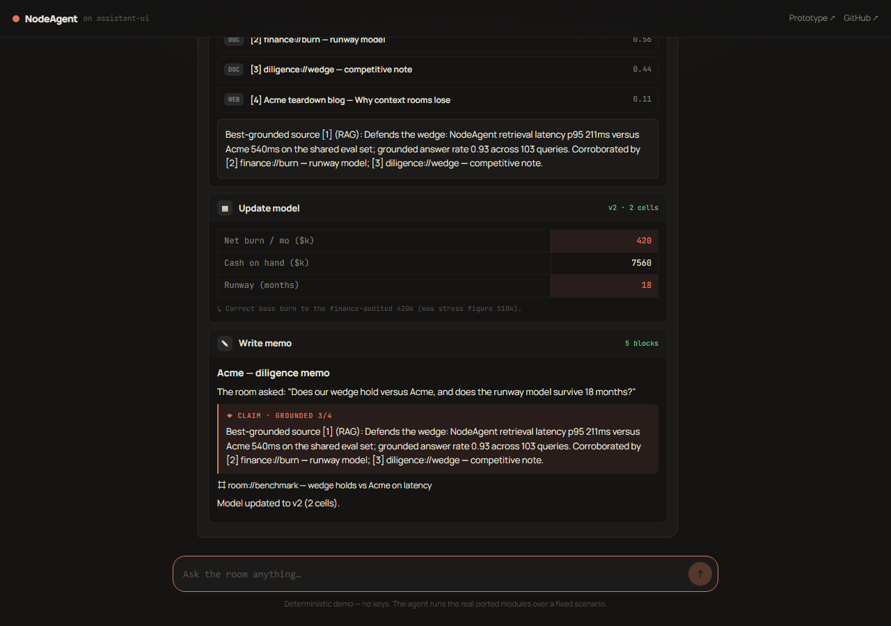
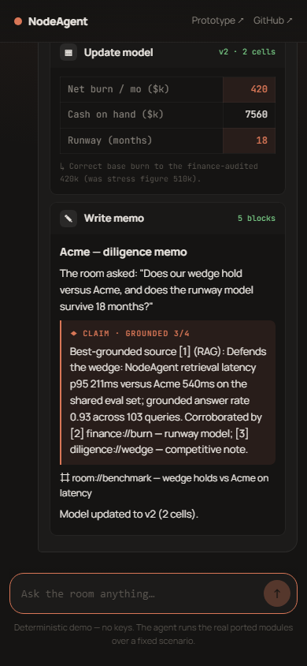

<div align="center">

# NodeAgent

### The room asks. The agent answers — with sources, a model, and a memo.

**A cross-collaborative agent that gathers live context from a shared room, finds the right
document for the right answer, updates the model as a versioned delta, and writes it into a
notebook — as one loop.**

**Built on [assistant-ui](https://github.com/assistant-ui/assistant-ui).** The live chat is the
Thread; each capability renders inline as a tool UI as the agent works.

`live chat + context` · `grounded search & synthesis` · `versioned spreadsheet` · `TipTap notebook`

[Quickstart](#quickstart) · [Built on assistant-ui](#built-on-assistant-ui) · [The four surfaces](#the-four-surfaces) · [Why this shape](#why-this-shape-a-career-compiled) · [Architecture](docs/ARCHITECTURE.md)

</div>

---

NodeAgent is the distilled, portfolio-grade core of [NodeBench AI](#provenance) — the four
capabilities I kept reaching for, rebuilt as clean, tested, dependency-light TypeScript, wired
into a single agent loop, and presented as an **[assistant-ui](https://github.com/assistant-ui/assistant-ui)
chat**. It runs with **no keys at all** (deterministic demo data) and ships the **Convex schema +
modules** that back the live, multiplayer version.

> **One loop, four tool UIs.** Ask the room a question → the agent gathers the relevant context →
> searches and synthesizes a *grounded, cited* answer → corrects the model and bumps its version →
> writes the memo. Each step renders inline in the conversation as an assistant-ui tool UI. Every
> step is bounded, every failure is surfaced, and the whole thing is honest about what it doesn't know.

<div align="center">



<sub>The React app (<code>@assistant-ui/react</code>): one prompt drives the loop, and the four
capabilities render as inline tool cards — ranked sources with the winner, the versioned model
delta, the grounded notebook claim. <br/>
<b>No account, no keys</b> — deterministic demo over the real modules.</sub>

</div>

## Quickstart

```bash
# 1. The assistant-ui chat (the main surface). Ask the room; the agent's work
#    streams inline as tool UIs.
npm install
npm run dev            # http://localhost:5173 — type a question or tap a suggestion

# 2. The no-build prototype — a vanilla mirror of the same chat, zero install.
npm run proto          # opens /nodeagent-v1.html

# 3. Instant CLI — the real loop's math, no install, no build.
node demo/runNodeAgentDemo.mjs
npm run demo           # the loop over the canonical scenario, via tsx
```

Verify it for yourself:

```bash
npm run nodeagent:frame:smoke
npm run omnigent:nodeagent:smoke
npm run typecheck      # tsc --noEmit, clean
npm run test           # 31 scenario-based tests across the 4 modules + the loop
npm run build          # vite build, clean
```

`nodeagent:frame:smoke` proves the Fable-like bounded frame path:
`ReasoningFrame -> runNodeAgent -> FrameDelta -> verifier receipt`.
`omnigent:nodeagent:smoke` validates the Omnigent/Omniagent YAML specs, runs the
frame smoke, and writes `docs/eval/omnigent-nodeagent-smoke.json`. If the
Omnigent CLI is installed, the outer harness check is:

```bash
omni run examples/omnigent/nodeagent-worker.yaml
```

To light up the **live** paths (multiplayer room, live web retrieval, LLM synthesis), copy
`.env.example` → `.env.local` and add keys. With no keys, every live path falls back to the
deterministic demo — nothing breaks. Secrets are gitignored and `npm run secret-scan` refuses
to ship them.

## Built on assistant-ui

NodeAgent's UI is a real [assistant-ui](https://github.com/assistant-ui/assistant-ui) app — not a
bespoke chat clone:

- **The runtime** — `useLocalRuntime(nodeAgentChatAdapter)`. The adapter
  ([`nodeAgentChatAdapter.ts`](src/features/node-agent/runtime/nodeAgentChatAdapter.ts)) is a
  `ChatModelAdapter` whose `async *run()` executes the loop and streams the result back as an
  assistant message. Swap it for `useChatRuntime` (AI SDK) or a fetch-backed adapter to go live —
  the tool UIs and the modules don't change.
- **The Thread** — built from assistant-ui's headless primitives (`ThreadPrimitive`,
  `ComposerPrimitive`, `MessagePrimitive`) and themed with the design DNA — no Tailwind, no shadcn
  ([`NodeAgentThread.tsx`](src/features/node-agent/components/NodeAgentThread.tsx)).
- **The four capabilities are tool UIs** — each is a `makeAssistantToolUI` renderer
  ([`toolUIs.tsx`](src/features/node-agent/components/toolUIs.tsx)): `collect_context`,
  `search_synthesize`, `apply_spreadsheet_delta`, `write_memo`. They render *inline in the
  assistant's message* as the agent works — the generative-UI pattern assistant-ui is built for.

`nodeagent-v1.html` is a faithful **vanilla mirror** of the same chat, for a zero-build demo.

## The four surfaces

Each renders as an assistant-ui tool UI; underneath, each is a real, tested module:

| Surface | What it does | Real module |
|---|---|---|
| **Live room** | Cross-collaborative chat; the collector ranks the few messages/docs that matter for the question (presence-TTL aware, bounded). | [`chat/contextCollector.ts`](src/features/chat/contextCollector.ts) |
| **Search & synthesize** | The 4-layer grounding pipeline: confidence gate → grounding filter → synthesis → citation chain. Finds the *right document* and **declines rather than fabricates** when grounding is weak. | [`search/searchAndSynthesize.ts`](src/features/search/searchAndSynthesize.ts) |
| **Spreadsheet model** | Every edit is a **versioned delta** with optimistic concurrency, dependent recompute (a safe `eval`-free formula parser), and an audit log. Non-conflicting concurrent edits auto-rebase. | [`spreadsheet/applySpreadsheetDelta.ts`](src/features/spreadsheet/applySpreadsheetDelta.ts) · [`versionedSpreadsheetSync.ts`](src/features/spreadsheet/versionedSpreadsheetSync.ts) |
| **Notebook** | The TipTap document model as immutable, testable blocks — claim / citation / entity — with markdown export for shareable memos. | [`notebook/notebookEditor.ts`](src/features/notebook/notebookEditor.ts) |

These compose in [`node-agent/runtime/nodeAgentRuntime.ts`](src/features/node-agent/runtime/nodeAgentRuntime.ts) — the loop that returns a structured `AgentRunResult` and an **honest overall status** (`ok` only when every step completed).

## Why this shape: a career, compiled

NodeAgent isn't four features that happen to sit together. Each one is the production form of a
problem I already spent years solving — the agent is the part that finally makes them one loop.

- **Banking / finance → the versioned spreadsheet.** Years where a wrong assumption had to be a
  tracked, defensible change — never a silent overwrite — became the delta engine. Every edit is
  a version bump with a before/after audit and optimistic-concurrency conflict handling.
- **Data engineering → context gathering + grounded search.** Pipelines that turned messy,
  multi-source inputs into structured truth became the context collector and the 4-layer
  grounding pipeline: retrieval confidence, claim grounding, citation chains.
- **Agentic AI → the runtime.** Tool orchestration, schemas, and eval discipline became the loop
  that drives all four surfaces — bounded, deterministic where it can be, honest about failure,
  traceable end to end.

Read the full retrospective in [`docs/TECH_RETRO.md`](docs/TECH_RETRO.md).

## Mobile parity

The chat is responsive web → mobile with verified parity (zero horizontal overflow; tool cards
stack; the composer pins to the bottom):

<div align="center">

</div>

## How it stays honest

This repo follows the same agentic-reliability discipline as its parent. The seams are visible
in the code and the tests:

- **Frame-bounded execution.** `reasoningFrameRunner.ts` wraps the existing loop
  in a durable-style frame contract with explicit evidence checks and a verifier
  receipt; the smoke command fails if the demo frame cannot produce the expected
  runway delta and grounded memo.
- **Omnigent outside, NodeAgent inside.** Omnigent YAML is available for the
  optional outer harness, but NodeAgent owns runtime state, frames, evidence,
  spreadsheet deltas, and memo output.
- **No fabrication.** Grounding scores are *computed* from token overlap, never hardcoded. On
  weak grounding the pipeline returns an empty answer with an honest note instead of inventing one.
- **Honest status.** Stale spreadsheet edits surface a version *conflict*; they don't silently
  overwrite. The runtime returns `partial`/`error`, never a fake `ok`.
- **Bounded everything.** `MAX_ITEMS`, `MAX_OPS`, `MAX_LOG`, `MAX_SOURCES` — every collection
  has a cap.
- **SSRF guard** on the live-fetch path ([`isSafeFetchUrl`](src/features/search/searchAndSynthesize.ts)).
- **Deterministic.** Clocks are injectable; the same inputs produce the same memo (there's a test for it).

## Repo structure

```
NodeAgent/
├── nodeagent-v1.html              # vanilla mirror of the assistant-ui chat (no build)
├── index.html · src/app/          # the assistant-ui React app (Vite)
├── src/features/
│   ├── node-agent/
│   │   ├── components/            # assistant-ui: NodeAgentThread · toolUIs · DemoApp
│   │   ├── runtime/               # nodeAgentRuntime · nodeAgentChatAdapter (ChatModelAdapter)
│   │   ├── tools · types · demoScenario
│   ├── chat/contextCollector.ts
│   ├── search/searchAndSynthesize.ts
│   ├── spreadsheet/               # applySpreadsheetDelta · versionedSpreadsheetSync
│   └── notebook/notebookEditor.ts
├── src/mcp/toolRegistry.ts        # progressive-discovery tool registry
├── convex/schema.ts               # the live backend contract
├── demo/                          # runNodeAgentDemo.ts (real) · .mjs (zero-dep mirror)
├── tests/                         # 31 scenario-based tests
├── scripts/secret-scan.mjs        # refuses to ship secrets (gates the push)
└── docs/                          # ARCHITECTURE · TECH_RETRO · DEMO_SCRIPT · MIGRATION_MAP
```

## Provenance

NodeAgent is distilled from **NodeBench AI**, a 300+-tool agent platform (live collaborative
rooms, a 4-layer grounded search pipeline, TipTap notebooks, Convex-backed spreadsheets). The
mapping from there to here — what was kept, simplified, and reduced to pure TypeScript — is in
[`docs/MIGRATION_MAP.md`](docs/MIGRATION_MAP.md).

The UI is built on **[assistant-ui](https://github.com/assistant-ui/assistant-ui)** (`@assistant-ui/react`) —
its `LocalRuntime` / `ChatModelAdapter` and `makeAssistantToolUI` generative-UI primitives. Each
module that borrows the pattern cites it in its header comment.

## License

MIT © [Homen Shum](https://github.com/homenshum)
