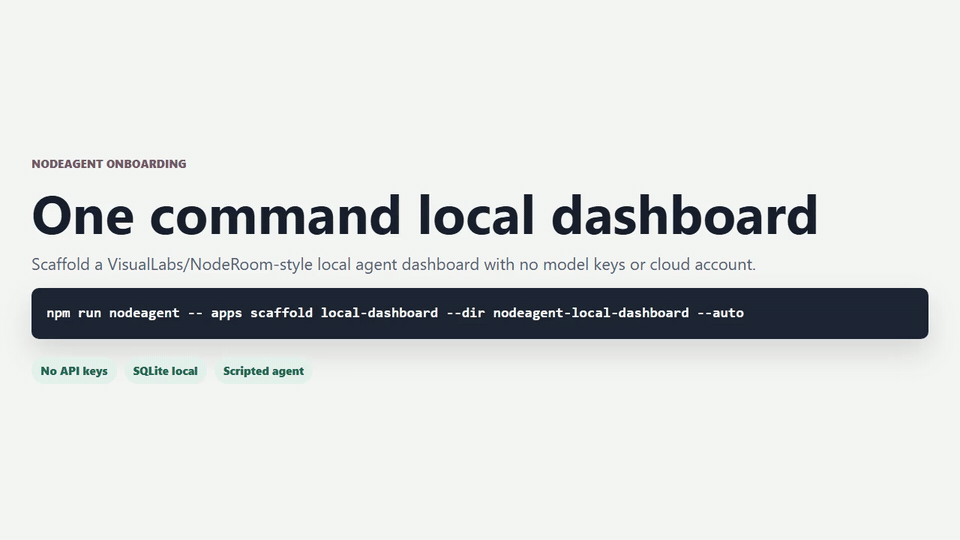
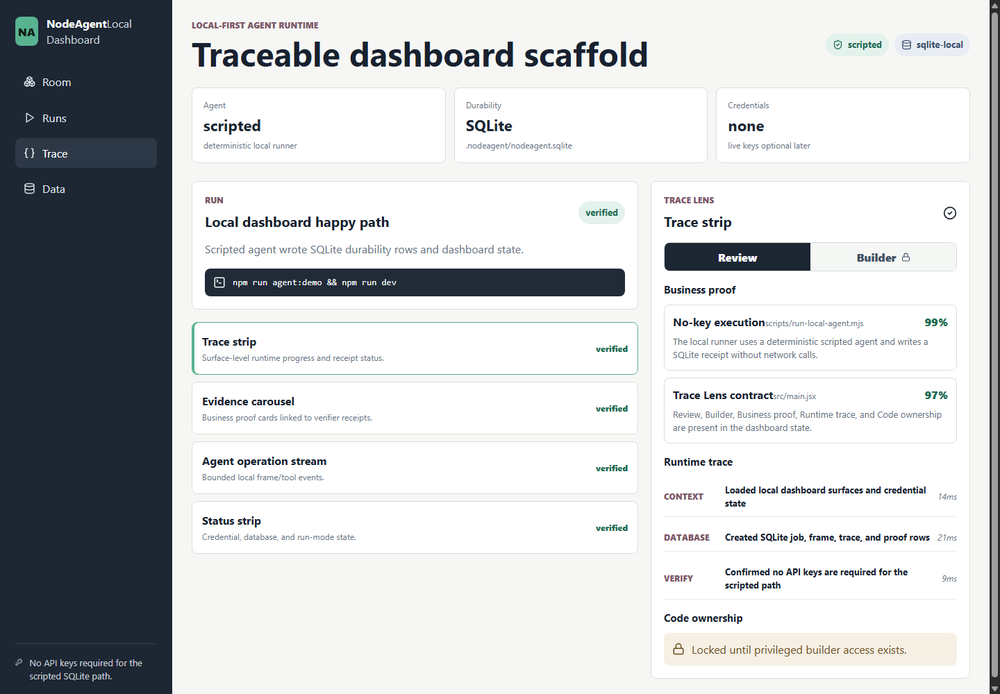
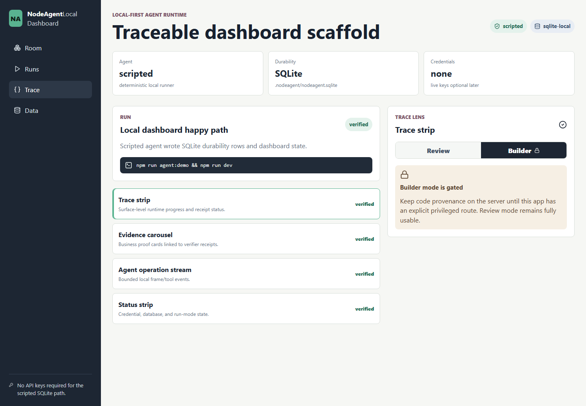
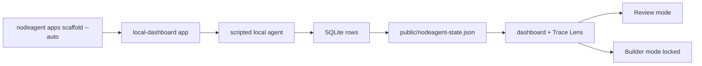

# Local Dashboard Visual Walkthrough

This walkthrough shows the no-key local dashboard scaffold created by NodeAgent.
It is the path a coding agent should run before adding custom tools, model
providers, or cloud durability.

## MP4/GIF Walkthrough



MP4 version: [nodeagent-local-dashboard-walkthrough.mp4](walkthroughs/nodeagent-local-dashboard-walkthrough.mp4)

The clip covers onboarding, the automated setup process, the finished local
dashboard, and the default locked Builder/code ownership state.

## 1. Run Autopilot Setup

```bash
npm install
npm run nodeagent -- apps scaffold local-dashboard --dir nodeagent-local-dashboard --auto
```

`--auto` runs the complete local proof:

- creates the Vite/React app
- installs dependencies
- runs the scripted local agent
- writes SQLite rows
- writes `public/nodeagent-state.json`
- runs smoke
- runs build
- writes `.nodeagent/setup-receipt.json`

No API key or cloud account is required.

## 2. Open The Dashboard

```bash
cd nodeagent-local-dashboard
npm run dev
```



What to verify:

- `Agent` is `scripted`.
- `Durability` is `SQLite`.
- `Credentials` is `none`.
- The run is `verified`.
- The Trace Lens panel is visible with `Business proof`, `Runtime trace`, and
  `Code ownership`.

## 3. Confirm Builder Is Gated

Click `Builder` in the Trace Lens panel.



The correct default is locked. Code ownership must stay behind a privileged
server route until the app has real auth and policy checks.

## 4. Backend Shape

The generated app writes a local SQLite database and client-safe state file.

```text
.nodeagent/nodeagent.sqlite
public/nodeagent-state.json
docs/eval/local-dashboard-smoke.json
.nodeagent/setup-receipt.json
```



## 5. Coding-Agent Integration Prompt

```text
Use the generated NodeAgent local-dashboard app as the starting point.
Keep the scripted SQLite path green before adding providers.
Preserve Review, Builder, Business proof, Runtime trace, and gated Code ownership.
Put app-specific writes behind typed tools.
Run npm run smoke and npm run build after every integration step.
Do not require API keys for the first local run.
```

## 6. Done Criteria

- `.nodeagent/setup-receipt.json` has `"ok": true`.
- `npm run smoke` passes.
- `npm run build` passes.
- Dashboard opens locally.
- Builder/code ownership is locked by default.
- No secrets are written to logs, prompts, trace state, or eval receipts.
